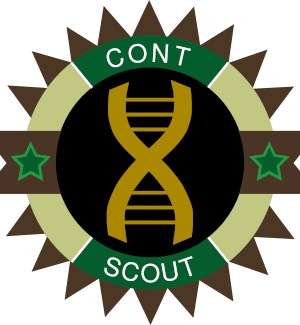

# ContScout
**Background**  
ContScout is a pipeline developed to identify and remove contaminating sequences from draft genomes. As input, our tool requires two files: predicted protein sequences in *fasta* format as well as a genome *annotation file* (gff, gff3 or gtf) linking protein IDs to contigs or scaffolds. (See user manual for details.)

**Working concept**  
Each query protein in the input file is first matched against a taxon-labelled reference database (for example: UniProt) using a speed-optimized search engine (MMSeqs, Diamond). Based on the taxon data from top-scoring database hits, each protein receives a high level taxon label (example: Virus, Archaea, Bacteria, Plant, Fungus, Animal, Other eukaryote). Protein-level taxon calls are then summarized over assembled genomic segments (scaffolds / contigs), followed by a consensus taxon assignment. Contigs (scaffolds) that disagree with the query taxon are removed, including all the protein they encode.

**Implementation**  
Contscout is implemented in R, pre-packaged as a Docker image, for convenient use.
docker pull h836472/contscout:biorxiv (note: archived version)

**More information**  
Please consult Balint et al. 2022 "Purging genomes of contamination eliminates systematic bias from evolutionary analyses of ancestral genomes" manuscipt, with a pre-print copy available at https://biorxiv.org/cgi/content/short/2022.11.17.516887v1.

**Important note**

This is the frozen script version that was used to perform all analyses in study Balint et al. 2022 "Purging genomes of contamination eliminates systematic bias from evolutionary analyses of ancestral genomes" manuscipt

