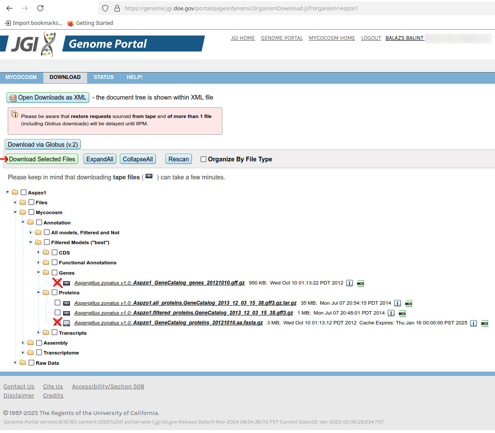

#GxF annotation fix hands on tutorial

**Background**

For ContScout to work properly, GxF annotation (GFF, GTF) file should fulfil two criteria:
1. Annotation file should have a "protein\_id" attribute
2. protein\_id tags from annotation file should match protein names as written in the fasta headers

If these pre-requisites are not met, ContScout will stop with one of the following errors:
+ Error found in annotation file. After GFF import, there should be exactly one \"protein_id\" column present. Exiting...
+ Error! Protein IDs in the protein sequence file completely differ from the IDs used in the GFF file. Exiting...

In this tutorial, 
+ we are going to download example data from JGI Mycocosm
+ we learn about a few R packages / functions that allow modification of fasta and GxF annotation files
+ fix example JGI input data for subsequent ContScout analysis

**Download example data**

Please visit JGI Mycocosm  *Aspergillus zonatus*  (Aspzo1) download page (https://genome.jgi.doe.gov/portal/Aspzo1/Aspzo1.download.html/).

Please note: in order to download the protein fasta file (Aspzo1_GeneCatalog_proteins_20121010.aa.fasta.gz) and the annotation file (Aspzo1_GeneCatalog_genes_20121010.gff.gz) you need to register for a JGI user account.

